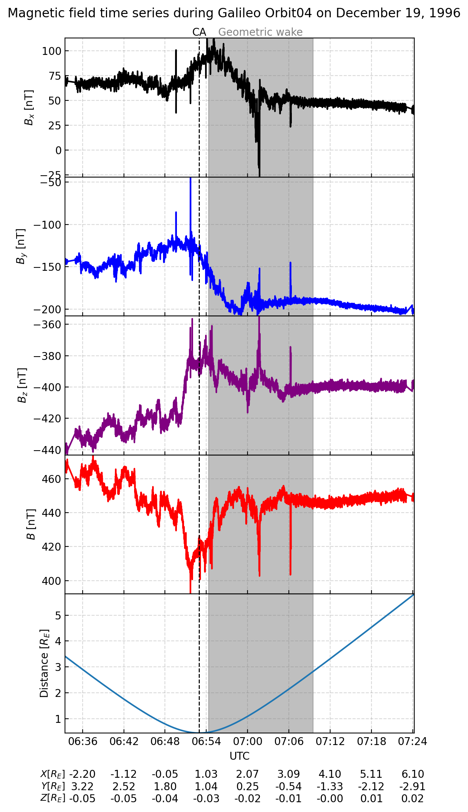
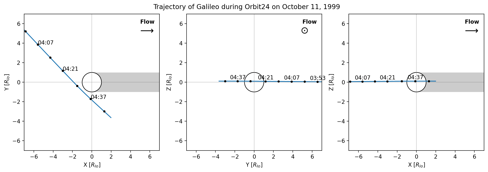

# **Ga**lileo Magnetometer Moon **P**lotting **T**ool

- __Authors__: Nathan M. Besch, Sebastian Cervantes

Create basic plots of magnetic field time series and orbits at Jupiter's moons using Galileo orbiter's high resolution magnetometer data from [NASA's PDS database]( https://search-pdsppi.igpp.ucla.edu/search/view/?f=yes&id=pds://PPI/galileo-mag-jup-calibrated).




## Installation steps (recommended)

Clone the repository:

```
git clone https://github.com/BlueNeptune11/GaPT.git
```

Create a new Python 3.13+ environment and go to the root of the project to install the required packages using pip:

```
pip install --upgrade pip
pip install -r requirements.txt
```

### Download the data

No automated routine to get the data, download the files you are interested in from NASA's PDS database. This repository currently works with [.TAB files accessible under `data-highres-moon_name` in PHIO coordinates.](https://search-pdsppi.igpp.ucla.edu/search/view/?f=yes&id=pds://PPI/galileo-mag-jup-calibrated)

Place all the files in `data/callisto/`,`data/europa/`,`data/io/` or `data/ganymede/` at the root of the project.

## Running the code

`galileo_mag_analysis.ipynb` presents what the code does, plotting functions are defined in `galileo_funcs.py`